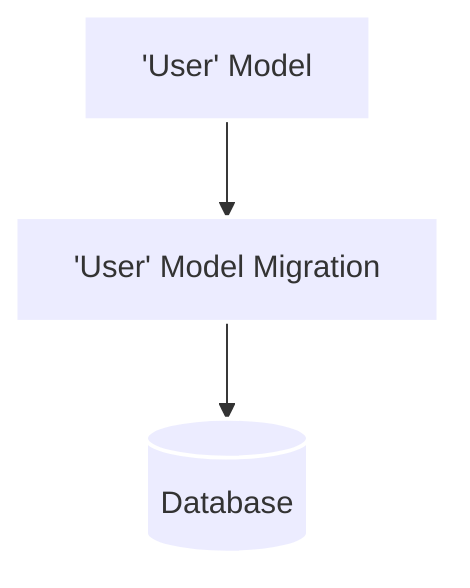

---
# try also 'default' to start simple
theme: default
# random image from a curated Unsplash collection by Anthony
# like them? see https://unsplash.com/collections/94734566/slidev
# background: https://source.unsplash.com/collection/94734566/1920x1080
# apply any windi css classes to the current slide
# https://sli.dev/custom/highlighters.html
highlighter: shiki
# show line numbers in code blocks
lineNumbers: false
# some information about the slides, markdown enabled
info: |
  ## Slidev Starter Template
  Presentation slides for developers.

  Learn more at [Sli.dev](https://sli.dev)
# persist drawings in exports and build
drawings:
  persist: false
# use UnoCSS
css: unocss
title: Why V3?
---
<div class="flex overflow-auto gap-5">
<div>

</div>

```sql
-- CreateTable
CREATE TABLE "User" (
    "id" TEXT NOT NULL PRIMARY KEY,
    "name" TEXT NOT NULL,
    "email" TEXT NOT NULL
);

-- CreateTable
CREATE TABLE "Task" (
    "id" TEXT NOT NULL PRIMARY KEY,
    "ownerId" TEXT NOT NULL,
    "title" TEXT NOT NULL,
    "description" TEXT,
    CONSTRAINT "Task_ownerId_fkey" FOREIGN KEY ("ownerId") REFERENCES "User" ("id") ON DELETE RESTRICT ON UPDATE CASCADE
);

```

<style>
.footnotes-sep {
  @apply mt-20 opacity-10;
}
.footnotes {
  @apply text-sm opacity-75;
}
.footnote-backref {
  display: none;
}
</style>
</div>

<!--
- Prisma generates migrations
- Can manually create migrations
-->