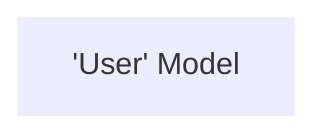

---
# try also 'default' to start simple
theme: default
# random image from a curated Unsplash collection by Anthony
# like them? see https://unsplash.com/collections/94734566/slidev
# background: https://source.unsplash.com/collection/94734566/1920x1080
# apply any windi css classes to the current slide
# https://sli.dev/custom/highlighters.html
highlighter: shiki
# show line numbers in code blocks
lineNumbers: false
# some information about the slides, markdown enabled
info: |
  ## Slidev Starter Template
  Presentation slides for developers.

  Learn more at [Sli.dev](https://sli.dev)
# persist drawings in exports and build
drawings:
  persist: false
# use UnoCSS
css: unocss
title: Why V3?
---
<div class="grid grid-cols-2">
<div>

</div>

<div>
Example Prisma Schema
```prisma {all|10-15|17-23}
generator client {
  provider = "prisma-client-js"
}

datasource db {
  provider = "postgresql"
  url      = env("DATABASE_URL")
}

model User {
  id String @id @default(uuid())
  name String
  email String
  tasks Task[]
}

model Task {
  id String @id @default(uuid())
  owner User @relation(fields: [ownerId], references: [id])
  ownerId String
  title String
  description String?
}
```
</div>

<style>
.footnotes-sep {
  @apply mt-20 opacity-10;
}
.footnotes {
  @apply text-sm opacity-75;
}
.footnote-backref {
  display: none;
}
</style>
</div>

<!--
- Start with the Prisma schema - defines your models
- Supports typicial db relations
-->