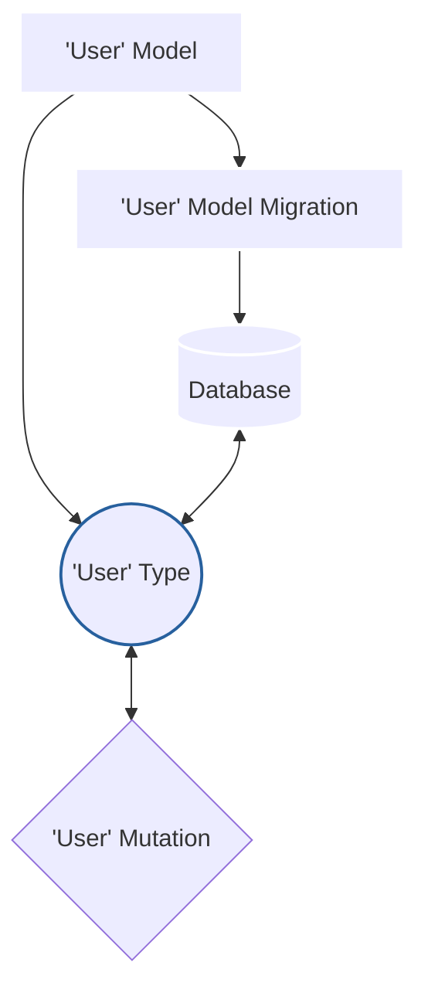

---
# try also 'default' to start simple
theme: default
# random image from a curated Unsplash collection by Anthony
# like them? see https://unsplash.com/collections/94734566/slidev
# background: https://source.unsplash.com/collection/94734566/1920x1080
# apply any windi css classes to the current slide
# https://sli.dev/custom/highlighters.html
highlighter: shiki
# show line numbers in code blocks
lineNumbers: false
# some information about the slides, markdown enabled
info: |
  ## Slidev Starter Template
  Presentation slides for developers.

  Learn more at [Sli.dev](https://sli.dev)
# persist drawings in exports and build
drawings:
  persist: false
# use UnoCSS
css: unocss
title: Why V3?
---
<div class="flex gap-1">
<div>

</div>

```ts {all|5-27|2|7-10|11|7-11|12-15|15-21|22-25}
import { z } from 'zod'
import type { User } from '@prisma/client'
import { TRPCError } from '@trpc/server'

export const userRouter = router({
  createUser: publicProcedure
    .input(z.object({
      id: z.string(),
      name: z.string(),
      email: z.string(),
    }) satisfies z.Schema<User>)
    .mutation(async (req) => {
      const user = await req.ctx.prisma.user.create({
        data: req.input,
      })
      if (!user) {
        return {
          type: 'error',
          error: new TRPCError({ message: 'failed to create a user', code: 'INTERNAL_SERVER_ERROR' }),
        } as const
      }
      return {
        type: 'ok',
        data: user,
      } as const
    }),
})


```

<style>
.footnotes-sep {
  @apply mt-20 opacity-10;
}
.footnotes {
  @apply text-sm opacity-75;
}
.footnote-backref {
  display: none;
}
</style>
</div>

<!--
- Talk about the graph - mutation has to go through type
- Routers/namespaces, procedures/functional-endpoints
- Import prisma type
- Validate input with Zod - satisfies the user type
- Mutate the database with typesafe client
- Typesafe responses, mention 'as const' which
narrows the type to be specific
-->